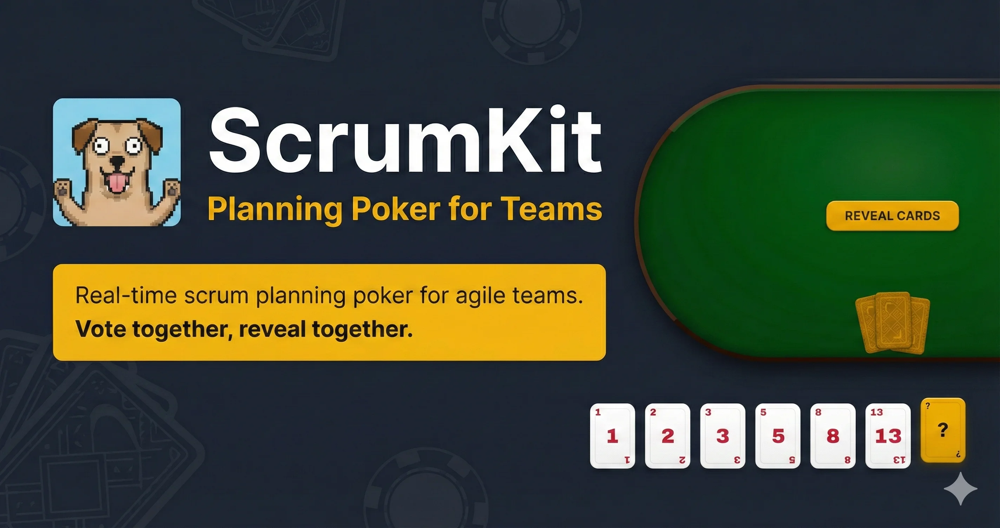

# ScrumKit

Real-time scrum planning poker for agile teams. Vote together, reveal together.



## Features

- **Real-time voting** - See who has voted (not what) before reveal
- **Emoji reactions** - Throw emojis at teammates during sessions
- **Auto-reconnect** - 30-second grace period for disconnected players
- **20 players per room** - Supports large teams
- **141 avatars** - Unique identity for each participant

## Tech Stack

- **Frontend**: Vue 3 + Vite + TypeScript
- **Backend**: Colyseus (WebSocket game server)
- **Runtime**: Bun

## Quick Start

```bash
# Install dependencies
bun install

# Start development servers
bun run dev

# View logs
bun run logs
```

**Ports**: Frontend (7000) | Backend (7001)

## Project Structure

```
packages/
├── frontend/    # Vue + Vite app
├── backend/     # Colyseus server
└── models/      # Shared types (@colyseus/schema)
```

## Scripts

| Command | Description |
|---------|-------------|
| `bun run dev` | Start all services with pm2 |
| `bun run stop` | Stop all processes |
| `bun run logs` | View recent logs |
| `bun run status` | Check process status |
| `bun run build` | Build all packages |

## License

MIT
